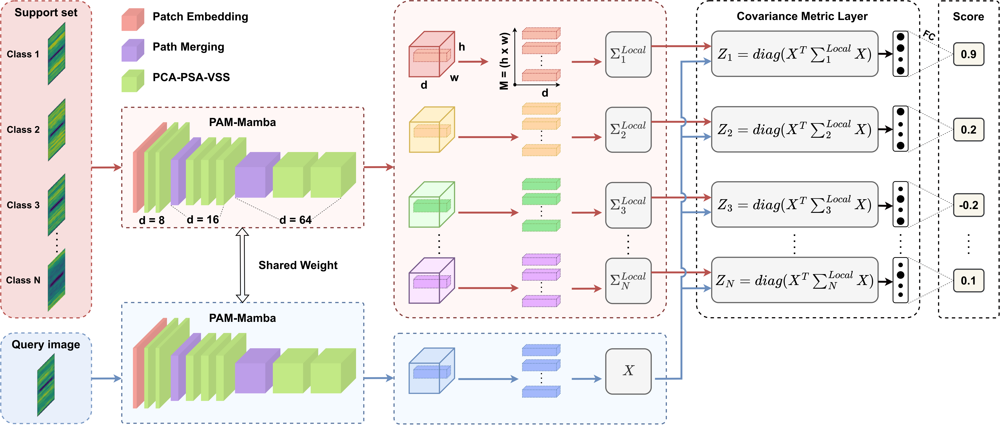

# MixMamba-Fewshot: Mamba and Attention Mixer-based Method with Few-Shot Learning for Bearing Fault Diagnosis

This is our implemented source code for the paper "[MixMamba-Fewshot: Mamba and Attention Mixer-based Method with Few-Shot Learning for Bearing Fault Diagnosis](https://doi.org/10.1016/j.compeleceng.2024.110004)" published in the Journal of Applied Intelligence
## Methodology



## Environment
```bash 
conda create -n MAMBA python=3.10.12 -y
conda activate MAMBA
pip install --upgrade pip
pip install -r requirements.txt
```

## Dataset
[CWRU Download Link](https://engineering.case.edu/bearingdatacenter)

## Getting Started
### Installation

``` bash
git clone https://github.com/linhthan216/Mamba-Bearing.git
cd few-shot-mamba
```

### Data
- You can install data for your experiments via command
```
gdown 1VZ5GbFPZV1lfkkyHpGtIiTuql4vYoyX3
unzip CWRU.zip
```

### Training
```bash
chmod +x train.sh
```
- 1-shot training

```bash
bash train.sh 1 
```
- 5-shot training
```bash
bash train.sh 5
```

### Testing

```bash
chmod +x test.sh
```
- 1-shot testing
```bash
bash test.sh 1 
```
- 5-shot testing
```bash
bash test.sh 5
```

## Contact
Please feel free to contact me via email bao.tg212698@sis.hust.edu.vn or giabaotruong.work@gmail.com if you need anything related to this repo!
## Citation
If you feel this code is useful, please give us 1 ⭐ and cite our paper.
```bash
@article{truong2025sc,
  title={SC-MambaFew: Few-shot learning based on Mamba and selective spatial-channel attention for bearing fault diagnosis},
  author={Truong, Gia-Bao and Tran, Thi-Thao and Than, Nhu-Linh and Nguyen, Thi Hue and Pham, Van-Truong and others},
  journal={Computers and Electrical Engineering},
  volume={123},
  pages={110004},
  year={2025},
  publisher={Elsevier}
}


```

